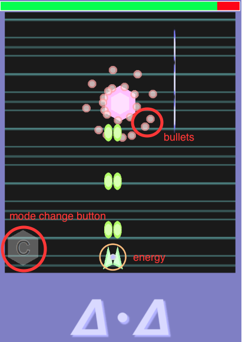

# delta-delta
## tmlib.js game shooting

## 紹介

『弾幕、どんとこい！』

Δ・Δ（デルタ・デルタ）はタッチデバイスで遊ぶことを想定した『簡単爽快シューティング』です。

tmlib.js（https://github.com/phi-jp/tmlib.js）で制作しています。

http://usamiyu.github.io/delta-delta/ (Google Chrome/Safari/mobile Safari 推奨)

## 操作方法

  * タッチデバイス
  
    * スライド：自機移動
    * ダブルタップor「C」マークをタッチ : モード切り替え

  * PC
  
    * マウスドラッグ : 自機移動
    * ダブルクリック or Zキー : モード切り替え

  * （非推奨） 
    * カーソルキー : 自機移動
    * Xキー : 低速移動
    

## 目的

   敵の弾や本体に当たらずに、コア（六角形のオブジェクト）を出来るだけ早く破壊してください。
   
   

## ショットモードとリフレクションモードについて

   初期状態はショットモードで、自動的にショットが発射されます。
   モードを切り替えてリフレクションモードになると、敵の弾を跳ね返すバリアが生成されます。
   跳ね返した弾は敵にダメージを与えることが出来ます。

## モード切り替えについて

   

   モードチェンジボタン（もしくはダブルタップ）操作で、モードを切り替えることが出来ます。
   ショットモードからリフレクションモードに切り替えるためには、エネルギーが50%以上必要です。
   リフレクションモード中にショットモードへ切り替えはいつでも行うことが出来ます。

## エネルギーについて

   エネルギーはショットモード時は少しずつ増加して、リフレクションモード時は少しずつ減少します。
   ショットモード時に敵弾が自機の近くにある場合、通常より多くエネルギーが増加します。
   リフレクションモード時にエネルギーが0になると、リフレクションモードから自動的にショットモードに戻ります。

## オブジェクトについて

   オブジェクトを破壊すると、弾をばら撒きます。これを利用して、弾をたくさん反射させましょう。
   ただし、オブジェクトがバリアに激突すると、エネルギーが大幅に減少します。
   
   
## ライセンスについて

srcディレクトリ以下のスクリプトファイルはMIT Licenseにて公開しております。LICENSE.txtをご覧ください。

This software is released under the MIT License, see LICENSE.txt.

libディレクトリ以下のスクリプトファイルは、各ページにてご確認ください。

   * bulletml.min.js
    * https://github.com/daishihmr/bulletml.js

   * marked.js
    * https://github.com/chjj/marked

fontsディレクトリ以下のフォントファイルの利用については、各フォルダのtxtファイルをご覧ください。

   * Audiowide
    * OFL.txt

   *Inconsolata
    * OFL.txt

